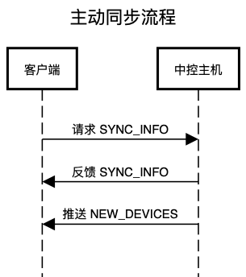
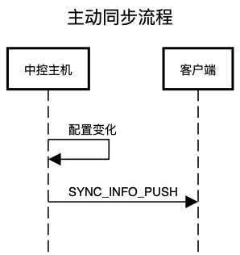
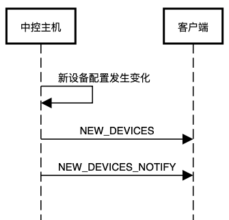

# 主机数据处理流程

## 同步数据

* `SYNC_INFO` 和 `SYNC_INFO_PUSH` 的报文结构是一样的，所以处理逻辑最好统一。

### 主动触发

登录主机成功之后，发送 `SYNC_INFO` 请求，主动向中控同步数据，此时中控返回同步数据后，直接全量更新进本地数据库。

### 推送

主机内配置发生变化时，主动向客户端发送 `SYNC_INFO_PUSH` 推送，此时客户端需要解析数据，与本地数据库对比，更新本地数据库。

## 新设备数据

对于新设备的处理需要根据两种情况判断：

1. 是否刚刚进行过同步操作
2. 是否有发现新设备推送 `NEW_DEVICES_NOTIFY`

### 主动触发同步报文之后

主动触发同步报文之后，主机除了向客户端返回主机内的同步报文数据，随即还会向客户端额外推送一条新设备数据。

### 推送

主机内的新设备配置发生变化之后，主机会向客户端推送新设备报文 `NEW_DEVICES`，同时推送发现新设备报文 `NEW_DEVICES_NOTIFY`。

